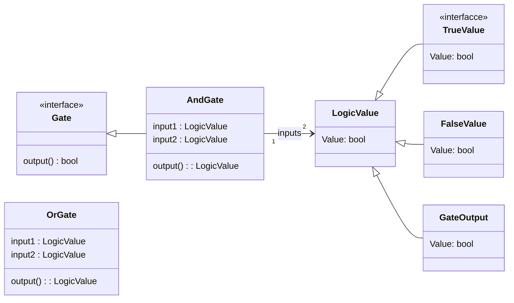

```mermaid
classDiagram
    direction LR

    class LogicValue{
        Value: bool
    }

    class TrueValue{
        <<interfacce>>
        Value: bool
    }

    class FalseValue{
        Value: bool
    }

    class GateOutput{
        Value: bool
    }
    
    class Gate{
        <<interface>>
        output() bool
    }

    class AndGate{
        input1 : LogicValue
        input2 : LogicValue
        output() : LogicValue
    }

    class OrGate{
        input1 : LogicValue
        input2 : LogicValue
        output() : LogicValue
    }

    %% Relaciones 
    LogicValue <|-- TrueValue
    LogicValue <|-- FalseValue
    LogicValue <|-- GateOutput

    %% Implementacion de la interfaz Gate
    Gate <|-- AndGate

    %% Relación de asociación: AndGate contiene/recibe instancias de LogicValue
    AndGate "1" --> "2" LogicValue : inputs
```
