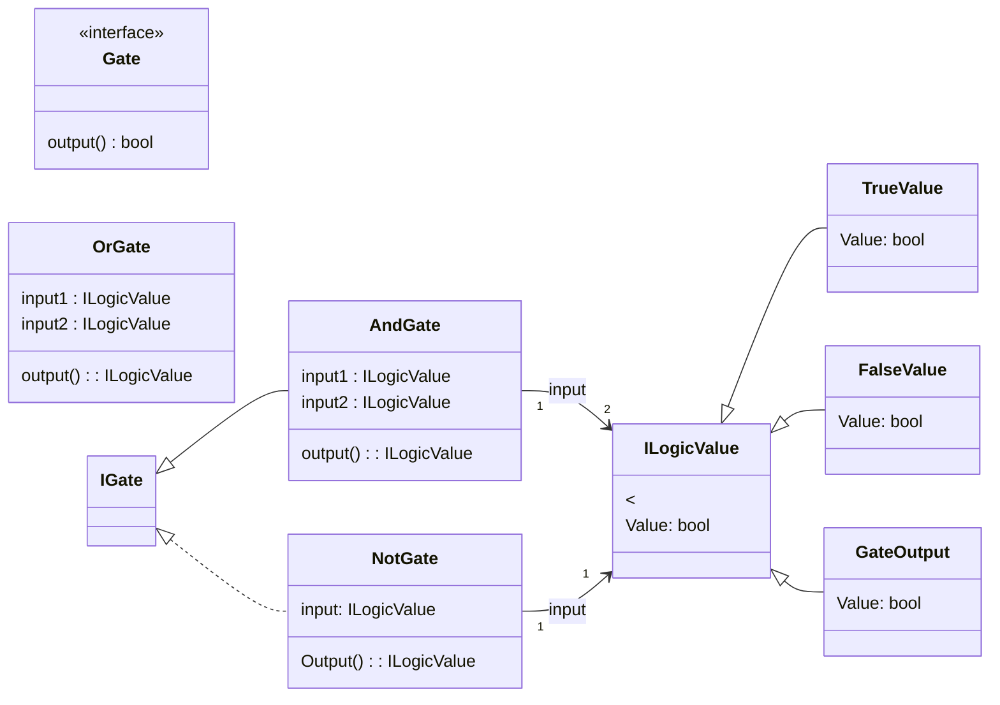

```mermaid
classDiagram
    direction LR

    class ILogicValue{
        <<interface>
        Value: bool
    }

    class TrueValue{
        Value: bool
    }

    class FalseValue{
        Value: bool
    }

    class GateOutput{
        Value: bool
    }
    
    class Gate{
        <<interface>>
        output() bool
    }

    class AndGate{
        input1 : ILogicValue
        input2 : ILogicValue
        output() : ILogicValue
    }

    class OrGate{
        input1 : ILogicValue
        input2 : ILogicValue
        output() : ILogicValue
    }

    class NotGate {
        input: ILogicValue
        Output(): ILogicValue
    }

    %% Relaciones 
    ILogicValue <|-- TrueValue
    ILogicValue <|-- FalseValue
    ILogicValue <|-- GateOutput

    %% Implementacion de la interfaz Gate
    IGate <|-- AndGate
    IGate <|.. NotGate

    %% Relación de asociación: AndGate contiene/recibe instancias de LogicValue
    AndGate "1" --> "2" ILogicValue : input
    NotGate "1" --> "1" ILogicValue : input
```
